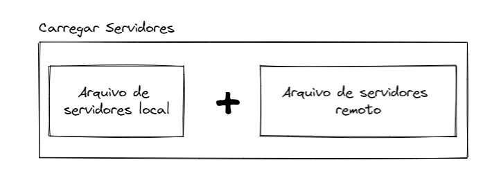
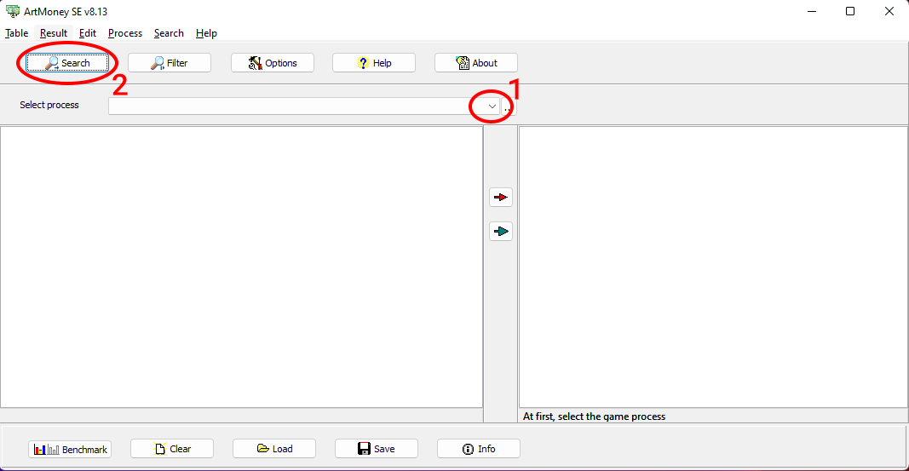
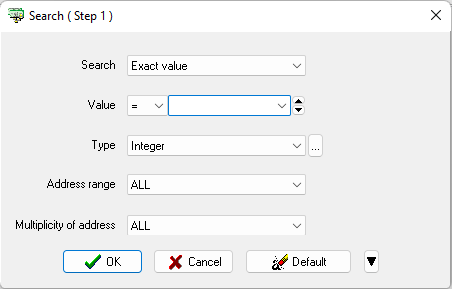
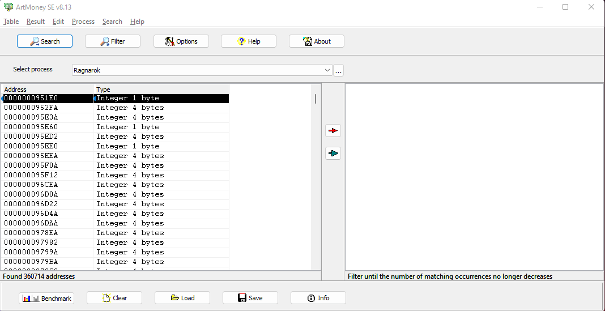

# Adicionando um novo servidor

## Entendendo como o 4RTools reconhece os servidores
O carregamento de servidores no 4RTools é um processo que pode passar por até 3 etapas e tem o seguinte comportamento:

1. Ler o arquivo `supported_servers.json` onde o 4RTools está instalado;
2. Ler o [arquivo remoto de servidores](https://github.com/4RTools/4RTools/blob/main/supported_servers.json).
3. Somar os servidores recuperados nos dois lugares e armazenar as informações.

!!! attention "Atenção"
    Caso você não possua o arquivo `supported_servers.json` e por algum motivo não consiga baixar o [arquivo remoto de servidores](https://github.com/4RTools/4RTools/blob/main/supported_servers.json). O 4RTools utilizará uma lista de servidores que está compilada junto com ele, pode ser que esteja desatualizada dependendo da versão que esteja utilizando

## Identificando os endereços de memória necessários
Para identificar os endereços de memória, você vai precisar de um programa para *sniffar* a memória. Para isso, utilizamos o  [ArtMoney SE 8.3](https://www.artmoney.ru/e_download_emul.htm).

### Listar todos os endereços do cliente

1. Selecionar o cliente do ragnarok 
2. Clicar no botão `Search` e abrir a janela de busca.

Uma tela semelhante a esta irá aparecer

Primeiro, vamos descobrir o endereço de memória relacionado ao hp do personagem.
Então, no campo `Value` digite o valor exato que o seu personagem tem de HP (não HP Máximo) no momento e clique em `OK`.

Se tudo der certo, vai ser exibido todos os endereços encontrados com os valores fornecidos, um desses valores é o que estamos buscando.

<i>Fig 3. Lista de endereços de memórias encontrados com o filtro.</i>

